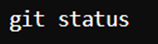

This is a simple application for my Git assignment 3 
1.	Setup Git Repository:
•	Initialize a new Git repository in a folder named my_project.  The commands create a new directory called "my_project," navigate into it, and initialize an empty Git repository there.

•	Create a file named README.md with a brief description of the project.  The command `git add README.md` stages the file `README.md` for the next commit in the Git repository.  The command `echo This is a simple application for my Git assignment 3 > README.md` writes the text "This is a simple application for my Git assignment 3" into the file `README.md`, creating or overwriting the file.

•	Stage and commit the README.md file to the repository.  This screenshot shows the result of a Git command, where the user committed a file named `README.md` with the message "Initial commit with README.md". The commit created one file with one insertion and a mode set to `100644`, indicating a regular file with read and write permissions.

2.	Making Changes and Version Control:
•	Create a new branch named feature-1. 

This screenshot shows a Git command where the user created a new branch named `feature-1` within their Git repository.

•	Switch to the feature-1 branch.  This screenshot shows a Git command where the user switched to the previously created branch named `feature-1` in their Git repository.

•	Add a new file named app.py with a simple Python script (e.g., a "Hello, World!" program).  This screenshot shows a command where the user creates a new Python file named `app.py` with the content `print("Hello, World!")` using the echo command.

•	Stage and commit the app.py file to the feature-1 branch.  This screenshot shows a Git command where the user stages the `app.py` file for the next commit by adding it to the Git index using the `git add` command.

•	Modify the app.py file to include a new function that prints your name.   The user commits the `app.py` file with the message "Add app.py with Hello, World! script", indicating that the file was added and committed with one insertion.
The user appends a new function definition to the `app.py` file using the echo command, adding a `print_name()` function that prints "Khalifa Alremeithi".
The user stages the updated `app.py` file for the next commit using the `git add` command.

•	Stage and commit the changes.  This screenshot shows the user staging the `app.py` file and then committing it with the message "Add function to print name," indicating the addition of a function to print a name.

3. Merging Branches: 
•	Switch back to the main branch.  This screenshot shows the user switching back to the `master` branch in their Git repository using the `git checkout master` command.

•	Merge the feature-1 branch into the main branch.  This screenshot shows the user merging the `feature-1` branch into the `master` branch using the `git merge feature-1` command. The merge was fast-forwarded, resulting in `app.py` being updated with two insertions.

•	Resolve any merge conflicts if they arise. There are no merge conflicts occurred but if so follow:  Fetches latest changes  Attempt to merge  Identify conflicts through this command

4. Using GitHub (or any other remote repository service): 
•	Create a new repository on GitHub named my_project.  This screenshot shows the GitHub repository page for a project named `my_project`, indicating it is public. 

•	Push the local my_project repository to GitHub.  This screenshot shows a series of Git commands where the user adds a remote repository, renames the default branch to `main`, and pushes the changes to the remote repository. The push operation sets up the `main` branch to track the `origin/main` branch.

•	Ensure that both main and feature-1 branches are available on the remote repository.  This screenshot shows a series of Git commands:

The user pushes the `main` branch to the remote repository.
The user lists the branches, showing `feature-1` and `main`, with `main` as the current branch.
The user switches to the `feature-1` branch.
The user pushes the `feature-1` branch to the remote repository, setting it to track `origin/feature-1` and suggesting creating a pull request on GitHub.
 This screenshot shows the branches page of the GitHub repository, listing two branches: `main`, which is the default branch and was updated 7 minutes ago, and `feature-1`, which was updated 1 minute ago.

5. Collaboration Simulation: 
•	Create another branch named bugfix-1.  This screenshot shows the user creating and switching to a new branch named `bugfix-1` using the `git checkout -b bugfix-1` command.

•	Simulate a bug fix by making a small change to the app.py file (e.g., correcting a typo).  This screenshot shows the user modifying the `app.py` file by adding a new function `print_name` with the corrected name "Khalifa Abdulla Al Remeithi" and a `print("Hello World!!")` statement using the `echo` command.

•	Stage and commit the changes on the bugfix-1 branch.  This screenshot shows the user staging the `app.py` file with `git add app.py` and committing the changes with the message "Fix typo in print_name function". The commit resulted in one file changed, with one insertion and two deletions.

•	Push the bugfix-1 branch to the remote repository.  This screenshot shows the user pushing the `bugfix-1` branch to the remote repository using the `git push -u origin bugfix-1` command. The push operation sets up the `bugfix-1` branch to track `origin/bugfix-1` and suggests creating a pull request on GitHub. 

•	Open a pull request on GitHub to merge bugfix-1 into main.  

This screenshot shows a pull request on GitHub where the user Khalifa Alremeithi wants to merge one commit from the `bugfix-1` branch into the `main` branch. The pull request includes a commit with the message "Fix typo in print_name function." The interface suggests adding reviewers and setting up continuous integration.

•	Complete the pull request.
 This screenshot shows that the pull request to merge the `bugfix-1` branch into the `main` branch has been successfully merged and closed by Khalifa Alremeithi. It indicates that the `bugfix-1` branch can now be safely deleted.

6. History and Reversion: 
•	Use Git to view the commit history. 
  The Git log shows four commits: initial commit with `README.md`, adding `app.py` with "Hello, World!" script, adding a `print_name` function, and fixing a typo in that function.

•	Revert the last commit on the main branch.  

This screenshot shows the user reverting the last commit using `git revert HEAD`, which undoes the previous commit that fixed a typo in the `print_name` function.
•	Explain how to undo the revert if necessary.
Undoing a reversion includes:

Using git log to identify the reverted commit hash.
Reverting the revert commit with git revert .
Git push is used to push changes to a remote repository.

To reverse a revert, use Git to revert the revert commit. This produces a new commit that reverses the changes made by the preceding revert.

Following these procedures allows you to effectively undo a revert and restore the previously reverted modifications.

